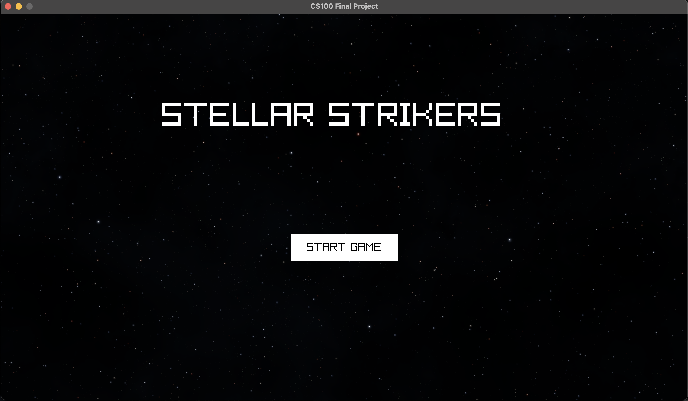
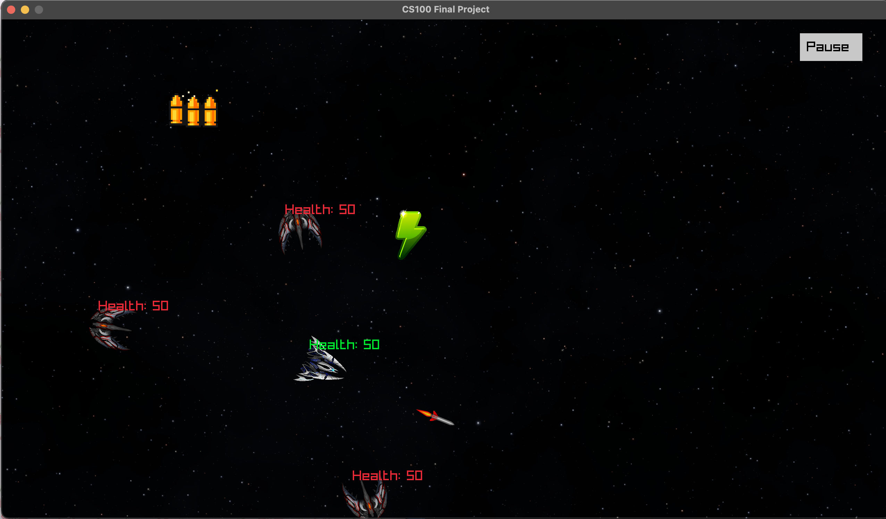
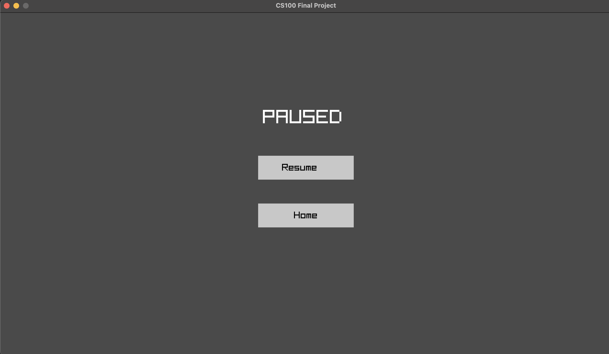
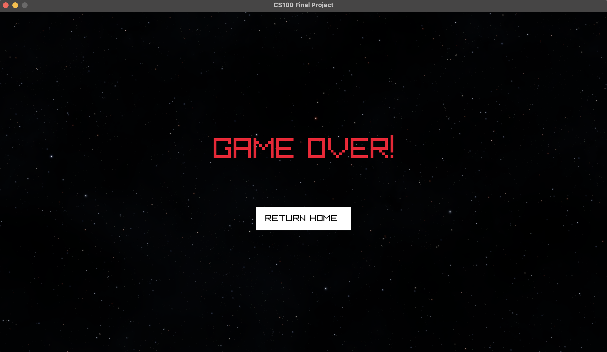

 # Stellar Strikers
 
 > Authors: \<[Kian Heydari Marvi](https://github.com/MERL10N)\>
 > \<[Rome Jone](https://github.com/rjone062)\>
 > \<[Steven Lau](https://github.com/stevenlau1343)\>
 > \<[Juan Zamora Cortes](https://github.com/JuanZ022)\>
 > \<[Leslie Velderrain](https://github.com/leslievelderrainx)\>

## Project Description
 > * Stellar Strikers is a 2D Space Shooter in which players are tasked to defend themselves from enemy ships for as long as they can. Enemies come in waves, which each subsequent wave becoming progressively more challenging. There will be a variety of enemies with their own set of attributes such as health, armor strength, and weapon type. The game ends when the player dies. 
 > * The purpose of this project not only serves as a fun way to put our C++ skills to the test, but also serves as an opportunity to dip our toes into Game Development in C++.

 > * Technologies used:
 >    * Language: C++
 >    * Library: Raylib (Graphics and Input) 

 > * Controls (Mouse & Keyboard):
 >    * W - Move Up
 >    * S - Move Down
 >    * A - Move Left
 >    * D - Move Right
 >    * Space Key - Fire bullet
 >    * Left Shift Key - Fire rocket
 >    * Click pause button with left mouse click - Pause Menu
 >    * Left Mouse click in main menu - Select menu button
 > *   Controls (Gamepad)
 >     *  Left analog stick - Move Up/Down/Left/Right
 >     *  Right Trigger - Fire Bullet
 >     *  Left Trigger  - Fire Rocket

 > * Proposed features:
 >   * Scoring System
 >   * Audio effects (Weapon fire, explosion, background music)
 >   * Powerups (Health recharge, damage boost, firerate boost)
 >   * Enemy AI (Using finite state machine)
 >   * Rounds-based progression
 >   * Sprite Animation (e.g for explosions) 

 > ## Phase II
 
## User Interface Specification

### Navigation Diagram
> 


### Screen Layouts


## Class Diagram


- Main Menu is where the program will start and it will generate the gameManager as well as provide a way to exit the game window or start the game
- GameManager will contain all components of the actual gameplay classes such as all subsequent menus + navigations and gameplay elements such as players and enemies
- scoreboard is a part of the GameManager and displays scores for the round as well as cumulative score
- PauseMenu is a part of the ScreenManager and will pause the game and provide options to resume, restart, and quit the game
- Player is the user and is a part of the gameManager. Player will give details on the position and status of the user
- Enemy is a part of the gameManager. Enemy will contain details on the position and status of an individual enemy
- projectile is an aggeragte of player and enemy and serves to establish superclass for different projectiles
- bullet is a part of projectile and handles default fire mode
- rocket is a aprt of projectile and handles alternate fire mode
-PowerUp is a dependency of Player and contains details on various powerups that can be applied to the player. It keeps track of the position of powerUps as well
-ScreenManager is a part of main and will handle different possible Screens as well as Game Over scenario
-waveManager is a part of GameManager and handles wave logic
-Health is an aggreagte of Player and Enemy and handles hleaht and damage logic
 
S.O.L.I.D Applied

We applied many SOLID principles throughout our program. Luckily, because it was logical to do so, many parts of the design already followed the SOLID principles
Specific cases:

Powerups Super Class contains core elements that will only be used in all sub-classes(L). Following the powerup Sub-Classes lead to the rapid fire and health power-up which both implement all derived parts while also adding their own unique functions (I)

Each class in our program has a single purpose whether it is to manage gameplay elements, manage projectiles, or manage player (S).

Because we are using superclasses to operate all parts of the game, future development can add more of anything they would like using sub-classes (O)

Our game does not contain dependencies(D).

The SOLID principles help keep our development clean and save time for future development. Through good use of classes, the game can be extended in any way whenever updates are pushed out.

 > ## Phase III
 > You will need to schedule a check-in for the second scrum meeting with the same reader you had your first scrum meeting with (using Calendly). Your entire team must be present. This meeting will occur on week 8 during lab time.
 
 > BEFORE the meeting you should do the following:
 > * Update your class diagram from Phase II to include any feedback you received from your TA/grader.
 > * Considering the SOLID design principles, reflect back on your class diagram and think about how you can use the SOLID principles to improve your design. You should then update the README.md file by adding the following:
 >   * A new class diagram incorporating your changes after considering the SOLID principles.
 >   * For each update in your class diagram, you must explain in 3-4 sentences:
 >     * What SOLID principle(s) did you apply?
 >     * How did you apply it? i.e. describe the change.
 >     * How did this change help you write better code?
 > * Perform a new sprint plan like you did in Phase II.
 > * Make sure that your README file (and Project board) are up-to-date reflecting the current status of your project and the most recent class diagram. Previous versions of the README file should still be visible through your commit history.
>  * Each team member should also submit the Individual Contributions Form on Canvas for phase III. In this form, you need to fill in the names of all team members, the percentage of work contributed by each member for phase III, and a description of their contributions. Remember that each team member should submit the form individually.
 
> During the meeting with your reader you will discuss: 
 > * How effective your last sprint was (each member should talk about what they did)
 > * Any tasks that did not get completed last sprint, and how you took them into consideration for this sprint
 > * Any bugs you've identified and created issues for during the sprint. Do you plan on fixing them in the next sprint or are they lower priority?
 > * What tasks you are planning for this next sprint.

 
 > ## Final deliverable
 > All group members will give a demo to the reader during lab time. ou should schedule your demo on Calendly with the same reader who took your second scrum meeting. The reader will check the demo and the project GitHub repository and ask a few questions to all the team members. 
 > Before the demo, you should do the following:
 > * Complete the sections below (i.e. Screenshots, Installation/Usage, Testing)
 > * Plan one more sprint (that you will not necessarily complete before the end of the quarter). Your In-progress and In-testing columns should be empty (you are not doing more work currently) but your TODO column should have a full sprint plan in it as you have done before. This should include any known bugs (there should be some) or new features you would like to add. These should appear as issues/cards on your Project board.
 > * Make sure your README file and Project board are up-to-date reflecting the current status of your project (e.g. any changes that you have made during the project such as changes to your class diagram). Previous versions should still be visible through your commit history.
>  * Each team member should also submit the Individual Contributions Form on Canvas for this final phase. In this form, you need to fill in the names of all team members, the percentage of work contributed by each member for the final phase, and a description of their contributions. Remember that each team member should submit the form individually.
 
 ## Screenshots
 

 

 

 
 ## Installation/Usage
 1. Clone the Repository: 
 * Open a terminal or command prompt and run the 
 following command to clone the repository
 ```bash
 git clone --recurse-submodules  https://github.com/cs100/final-project-the-four-loops.git
 ```
 2. Navigate to the Project Directory 
 ```bash
 cd final-project-the-four-loops
 ```
 3. Build/Run the Application
 ```bash
 cmake .
 make
 ./CS100_FinalProject
 ./CS100_FinalProject_tests
 ```

 ## Testing
 For our project, we implemented unit testing using the Google Test Framework. These tests cover various components of the project, including the Health class, Player class, Enemy Class, Powerup Classes, Game class, and Projectile classes. 

 1. Health Class:
 * Tested creating Health objects, taking damage, healing, and handling edge cases like health limits.

 2. Player Class:
 * Verified player position, health updates, and proper memory management with constructors and destructors.

 3. Enemy Class:
 * Tested state transitions (SHOOT, CHASE, DIE), bullet handling, and enemy life status.

 4. Powerup Classes:
 * HealthPowerUp: Checked activation, deactivation, and memory management.
 * RapidFirePowerup: Tested activation, deactivation, and initialization with position and texture.

 5. Game class: 
 * Verified the creation and cleanup of the Game object.

 6. Projectile Classes: 
 * Ensured proper creation, direction initialization, and cleanup for Bullet and Rocket.
 
